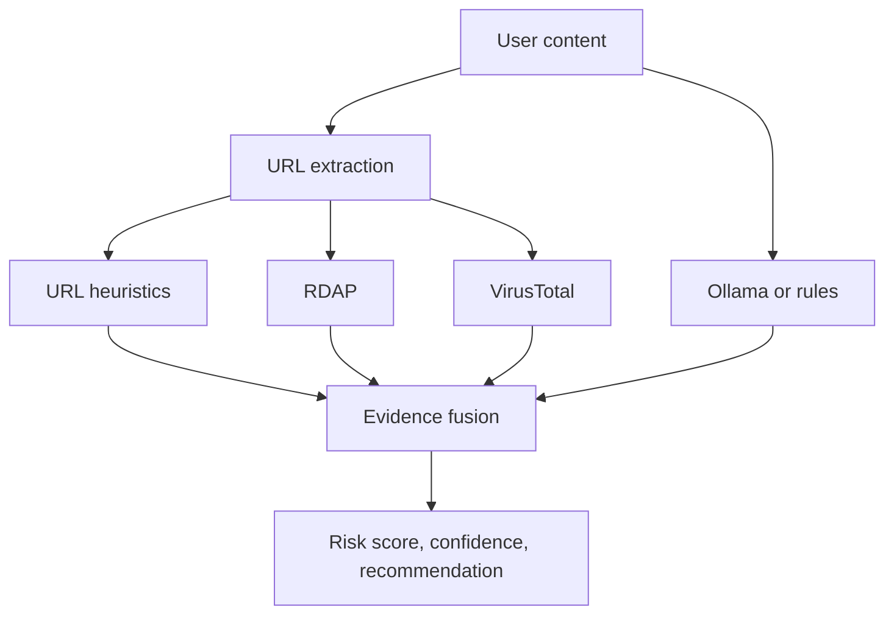

# Architecture

```mermaid
flowchart TD
  A[User content] --> B[URL extraction]
  B --> C[URL heuristics]
  B --> D[RDAP]
  B --> E[VirusTotal]
  A --> F[Ollama or rules]
  C --> G[Evidence fusion]
  D --> G
  E --> G
  F --> G
  G --> H[Risk score, confidence, recommendation]
```

All provider adapters are optional and return explicit availability status. Canonical evidence signal IDs prevent the same underlying signal from being double-counted.
